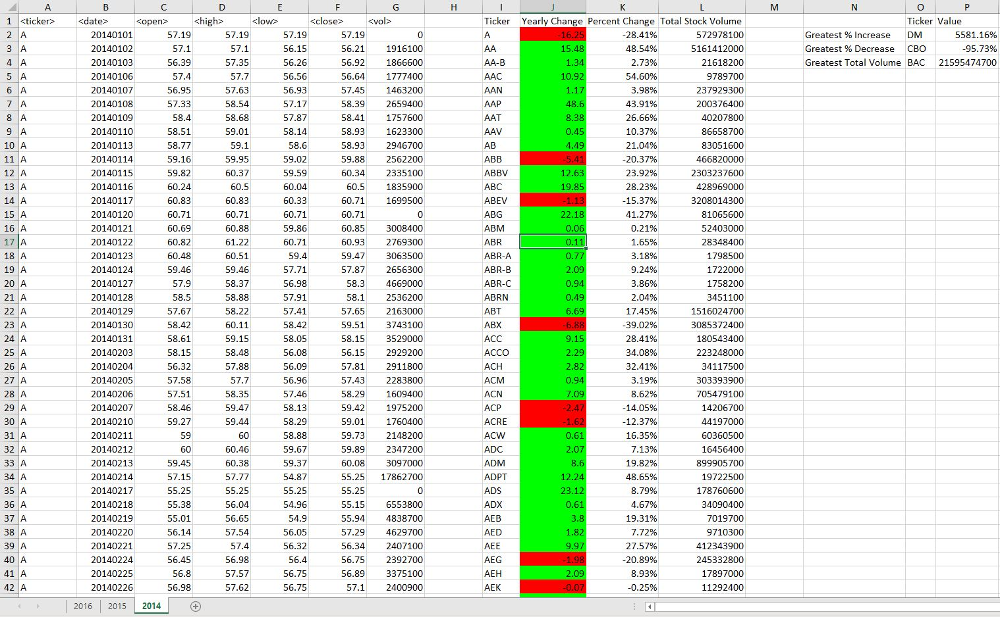
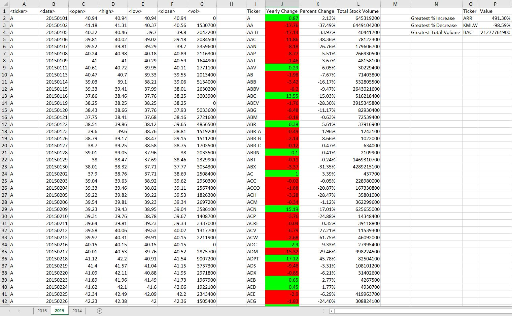
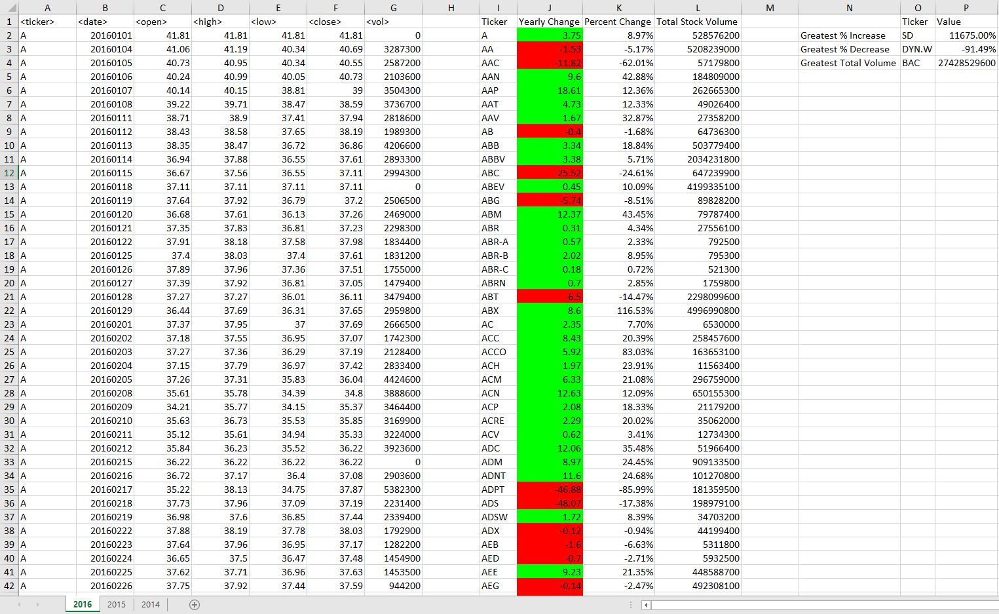

# The VBA of Wall Street

## **Objective:**
The objective of this project is to use VBA scripting to analyze stock market data. Using 2014-2016 stock market data, the yearly change, percent change, and total stock volume were calculated for each stock for each year of data. Additionally, the stocks with the greatest % increase, greatest % decrease, and greatest total volume for each year were identified. 

## **Tools:**
1. Excel VBA

## **Screenshots:**

2014 Stock Market Data

2015 Stock Market Data

2016 Stock Market Data

